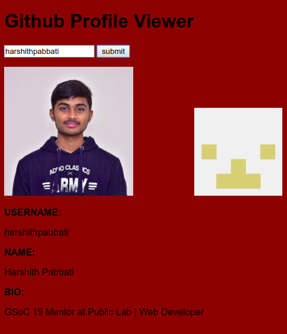

# :red_circle: Task 5

## Get It Using JavaScript

  * The above task is about Generating a web page using using the GitHub API.
  * This task was completed using GraphQL with JavaScript
  * The Website has been hosted on GitHub,but due to revoking of OAuth token it no longer serves it's purpose.However the Webpage  is accessible.
  * View my [Website](https://tbagz104.github.io).
  
 
   

  
