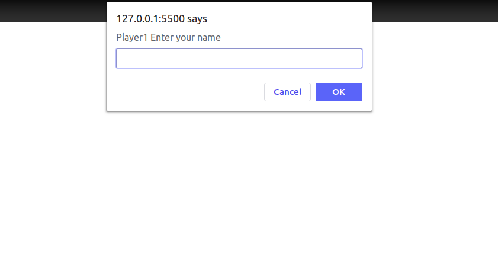
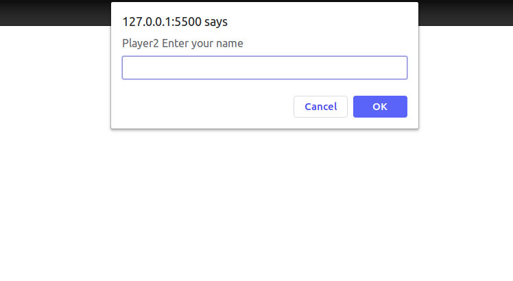
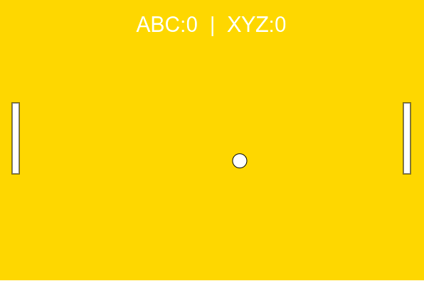

<<<<<<< HEAD
# :red_circle: Task 11

## A Pong Game

  *What is this task about :question:*

  * This task is all about creating a clone of Ping-Pong . 
  * The task was completed using JavaScript. 
  * It can be played as Multi-player.
  * An additional library [p5min.js](https://cdnjs.cloudflare.com/ajax/libs/p5.js/0.9.0/p5.min.js) was included as source to develop the game.
  * The game has been hosted on my [Website.](https://tbagz104.github.io/GitHubProfileViewer/)

### How to Play:question:

* Input first player name and press OK.

* Input second player name and press OK.

### Gameplay :video_game:

* The game will start once the player names are entered.

||||||| merged common ancestors
=======
# :red_circle: Task 11

## A Pong Game

  *What is this task about :question:*

  * This task is all about creating a clone of Ping-Pong . 
  * The task was completed using JavaScript. 
  * It can be played as Multi-player.
  * An additional library [p5min.js](https://cdnjs.cloudflare.com/ajax/libs/p5.js/0.9.0/p5.min.js) was included as source to develop the game.
  * The game has been hosted on my [Website.](https://tbagz104.github.io/GitHubProfileViewer/)
>>>>>>> 45bab22b764d474818f67ada8ff4ff37f2a56a84
